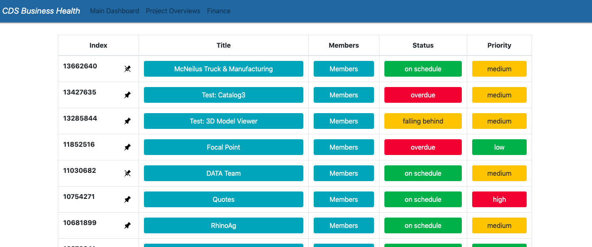
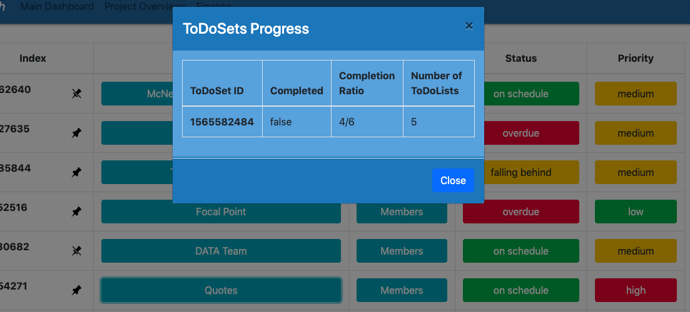

## CDSBusinessHealth Application ##

## About: ##
This program lists projects with options to access the people working on the project and list asignees with number of open tasks. It gives information about the status of the project which could be (overdue, onschedule or falling behind). it also gives information about the priority of the project(High,Medium,Low). All critical tasks are color coded. Red designates very critical, yellow is about to be critical and green is normal. This view will help project managers to see critical tasks which might be overdue or high priority. Also he can track how many open tasks an employee has and people working on the project with their email addresses listed.

## ScreenShots: ##

  
--

  

--
 

## Functionality ##

* Listing projects on the screen with ids, status and priority and showing critical tasks with color codes.

    * When a project button is clicked, listing the members of the project with number of  open tasks.
    * When members button is clicked showing the members working on the project  

## How To: ##

In this program, given projects (by API getAllProjects  with call "GET /projects.json" you can access todo-sets, from todo-sets, we can access todo-lists and from todo-lists we can access to-dos which are interpreted as tasks). Each project will have an array of tasks. Each task has a unique id, status (such as active or not), title, type, completed flag which states if project is completed, assignees for the project which is an array of people IDs, start date of the task, deadline of the task and also array of people IDs that are to be  notified when the task is completed. We have people list with their ID's, email addresses, avatars, names, titles , bio and role in the project which is designated by variable 'personableType'.

* getAllPeopleOnProject function searches all projects and tasks to see which are completed and gathers in an array each people on a project with open tasks. This information is gathered in 'membersofProjects' array. Functionality of the 'viewProject' is stated above. Project table is populated dynamically and when project button is clicked 'viewTasks' function is fired up. By using membersofProjects array, we can list for each project members with open tasks. But what we can access in the task is the person's id, we have to search the members array to find the entry matching with the id and getting the name from there. The table in modal-body is populated dynamically. When members button is clicked, the 'viewMember' function is fired up. By accessing the project id and assignee id, we can get information about a person. That information is listed on the table in a modal-body which again populated dynamically.