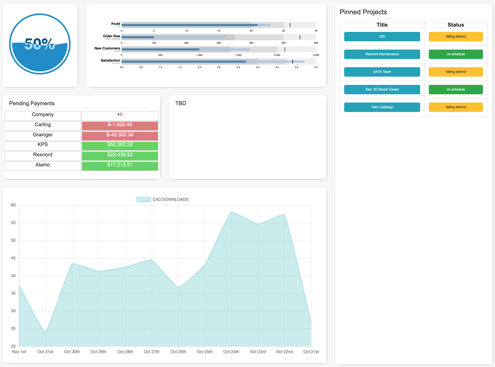

# CDSBusinessHealthApp

# Main Dashboard

## About: ##
This page represents the main dashboard, it includes 5 sections: 

    Overall Health Grade (Location: top row, left column): This section represents the overall health of all the projects. The data is averaged from the health of each given project; each projects health in particular is represented in the next section; Project Health Levels.

    Project Health Levels (Location: top row, middle column): Alot like the overall health grade section, these levels represent the healthgrade of each individual project. The Data is averged from these healthgrades to represent the overall healthgrade.

    Pending Payments (Location: middle row, left column): The pending payments section is representative of status of budget in each departmet on whether they are behind payments or ahead.

    General Financial Data (Location: bottom row, left column): This line graph shows the data representing the fluxuation of CAD Downloads within the last 12 days.

    Pinned Projects (Location: right column): This table has two columns: the left column representing the title of the given project and the right column representing the status of completion in relation to the projected deadline; Each row representing a seperate task/project. The data for this section is in relation to the project overviews page, please visit that page for more information regarding each project.

## Functionality: ##
The purpose of this page is to portray general information/progress of the given projects that are going on in the the company. It is meant to help facilitate the process of managing projects, to help give the user a good general idea of information regarding each given section.
